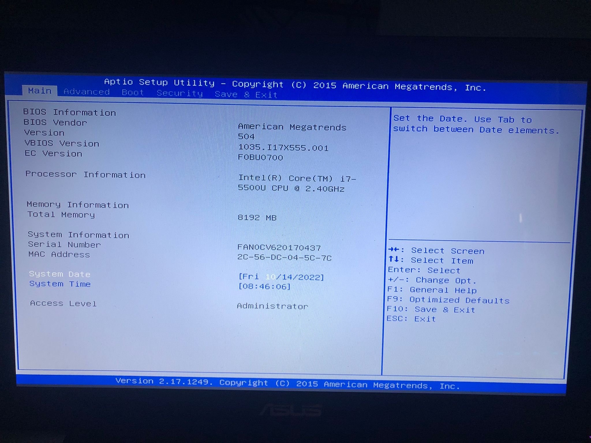
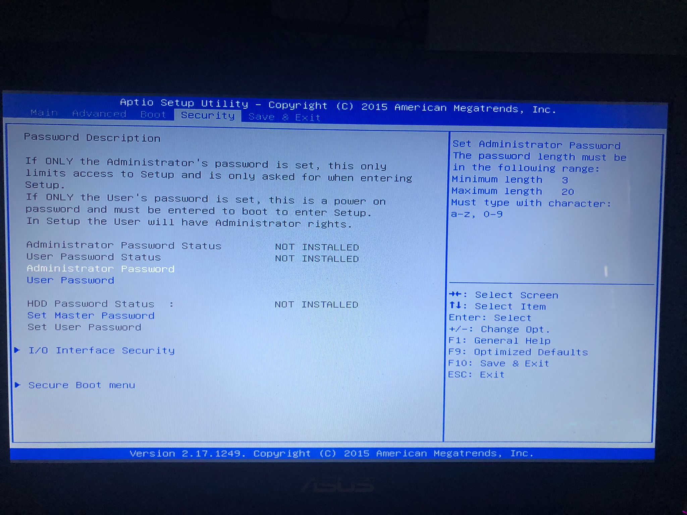
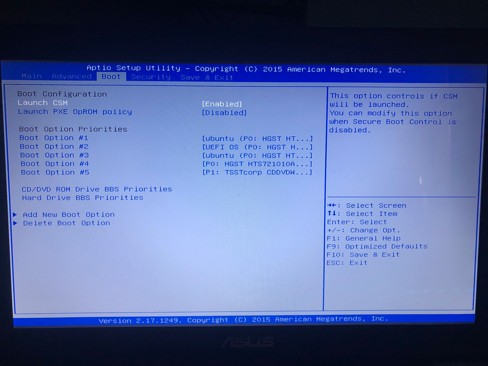
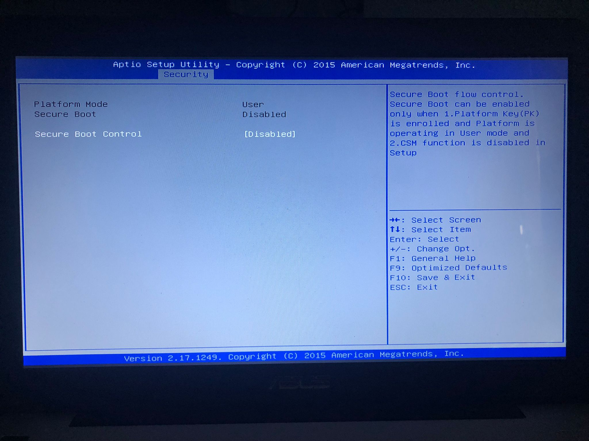
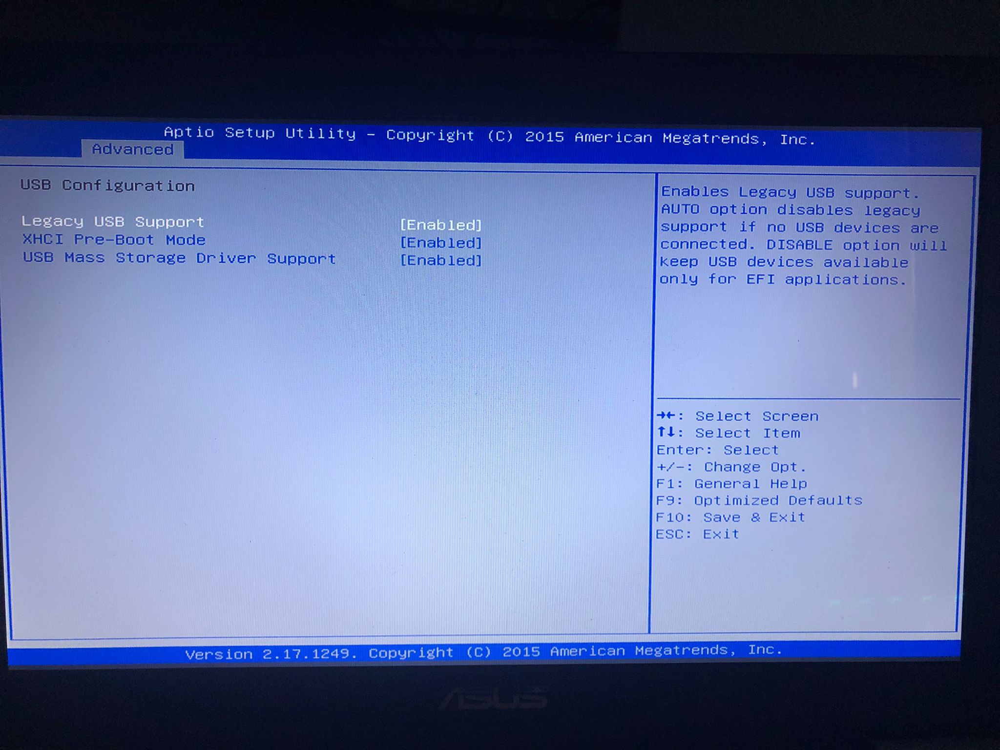
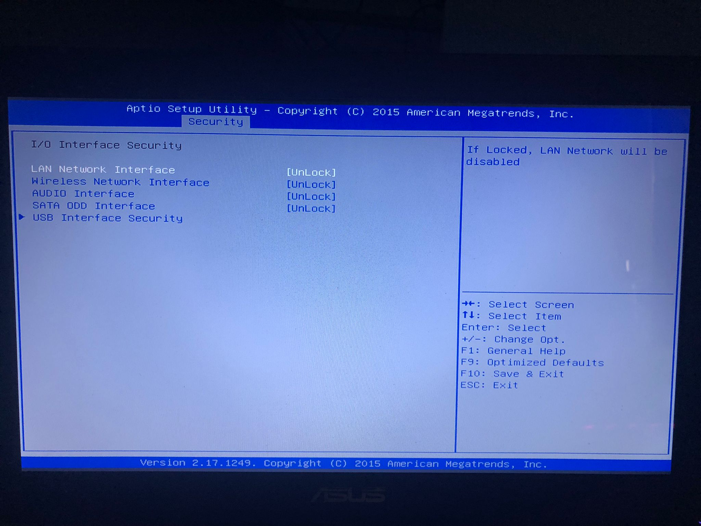
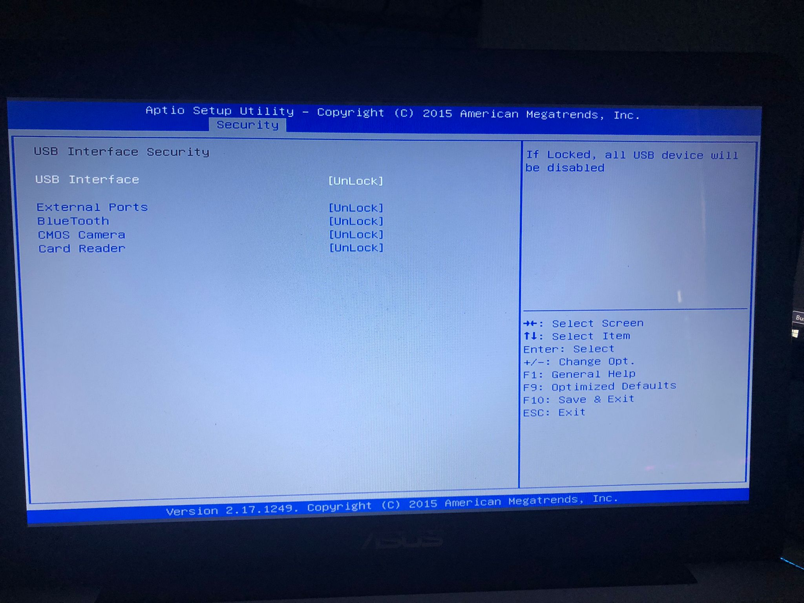

author: Alvaro Perez Rey
summary: Resumen del CodeLab
id: proyecto-1.1-bastionado
categories: codelab,markdown
environments: Web
status: Published
feedback link: Un enlace en el que los usuarios puedan darte feedback (quizás creando un issue en un repositorio de git)
analytics account: ID de Google Analytics

# Proyecto 1.1: Protección de la BIOS/UEFI

## Introducción

La BIOS, o UEFI en su versión mas moderna, es lo primero que se ejecuta en un ordenador al encenderse, su finción es recordar al dispositivo quién es, que hardware tiene instalado y qué es lo primero que debe arrancar.

Si no configuramos los parámetros necesarios en la BIOS para aportar seguridad al sistema, es muy sencillo manipular el arranque para conseguir acceso al dispositivo. A cotninuación explicaremos qué parámetros configurables, depende del modelo, son los mas comunes modificar para aumentar la seguridad de nuestro equipo.

## Contraseña de administración de la BIOS

## Contraseña de usuario de la BIOS

## Contraseña de arranque del dispositivo

## Permiso de arranque desde dispositivo USB

## Orden de arranque

## Secure Boot

## Otros parámetros

## Conclusión

### Metodos para modificar la BIOS

Negative
: Utilizar contraseñas maestras que tienen algunos fabricantes

Negative
: Quitar la pila de boton que tiene para que se borre la configuración previa de la BIOS

### Maximizar la seguridad
Texto plano dentro de cajas de información verdes y amarillas

Positive
: Cifrar el almacenamiento

Positive
: Evitar contraseñas genericas...

### Lista con viñetas
Texto plano en una lista con viñetas:

* Hola
* CodeLab
* Mundo

¡Ya tienes tu lista con viñetas creada!

### Lista numerada
1. Lista
2. Utilizando
3. Números

### Añade un enlace
¡Añadiendo un enlace!
[Ejemplo de enlace](https://www.davidlms.com)

### Añade una imagen
¡Añadiendo una imagen!

### Incrusta un iframe

