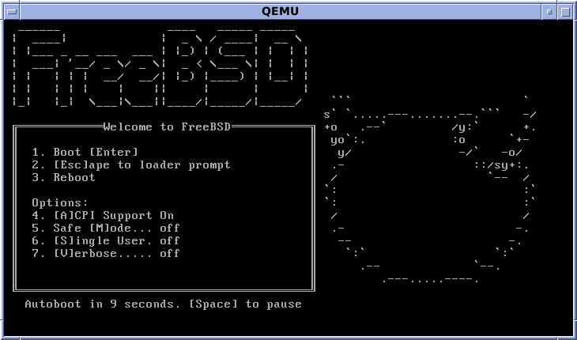

author: Alvaro Perez Rey
summary: Resumen del CodeLab
id: identificador-unico-del-codelab
categories: codelab,markdown
environments: Web
status: Published
feedback link: Un enlace en el que los usuarios puedan darte feedback (quizás creando un issue en un repositorio de git)
analytics account: ID de Google Analytics

# 
Proyecto 1: Bastionado del arranque del sistema

## Parte 1
En esta primera parte del proyecto, vamos a elaborar una guía para bastionar la BIOS/UEFI

### Cajas de información
Texto plano dentro de cajas de información verdes y amarillas

Negative
: Esto aparecerá en una caja de información amarilla.

Positive
: Esto aparecerá en una caja de información verde.

¡Ya tienes tus cajas de información creadas!

### Lista con viñetas
Texto plano en una lista con viñetas:

* Hola
* CodeLab
* Mundo

¡Ya tienes tu lista con viñetas creada!

### Lista numerada
1. Lista
2. Utilizando
3. Números

### Añade un enlace
¡Añadiendo un enlace!
[Ejemplo de enlace](https://www.davidlms.com)

### Añade una imagen
¡Añadiendo una imagen!

### Incrusta un iframe

## Parte 2
En esta segunda parte del proyecto, vas a elaborar una guía para bastionar el arranque de un sistema Debian actual a tu elección.

### Cajas de información
Texto plano dentro de cajas de información verdes y amarillas

Negative
: Esto aparecerá en una caja de información amarilla.

Positive
: Esto aparecerá en una caja de información verde.

¡Ya tienes tus cajas de información creadas!

### Lista con viñetas
Texto plano en una lista con viñetas:

* Hola
* CodeLab
* Mundo

¡Ya tienes tu lista con viñetas creada!

### Lista numerada
1. Lista
2. Utilizando
3. Números

¡Ya tienes tu lista numerada creada!

En la sección 2 vamos a añadir varios elementos más, una imagen entre ellos. Para añadir imágenes locales, crea una carpeta al lado de tu fichero .md llamada "img". Dentro de la misma, añade una imagen cualquiera que se llame prueba.png.

### Añade un enlace
¡Añadiendo un enlace!
[Ejemplo de enlace](https://www.davidlms.com)

### Añade una imagen
¡Añadiendo una imagen!

### Incrusta un iframe

